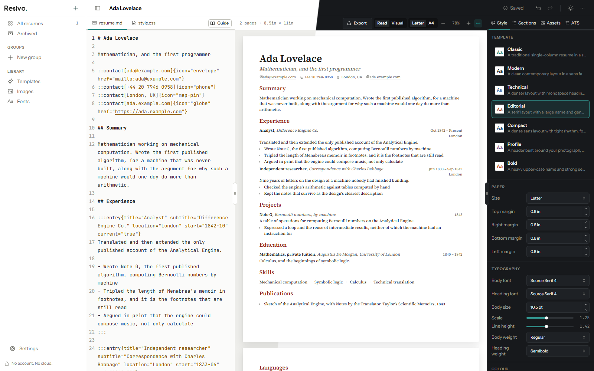

<h1 align="center">
  <picture>
    <source media="(prefers-color-scheme: dark)" srcset="public/brand/resivo-logo-dark.svg">
    
  </picture>
</h1>

<p align="center">
  A local-first resume builder. Everything lives in your browser, no account, no
  server, no network request that carries your data anywhere.
</p>

<p align="center">
  <a href="https://resivo-cv.vercel.app">Open the app</a>
</p>

Write a resume in Markdown or edit it directly on the page, style it with a
visual panel or your own CSS, and export it as a PDF, a single self-contained
HTML file, or Markdown.



There is also a [28 second tour](public/promo/resivo-promo.mp4), made from the app's
own code in `video/`.

## Why local-first

A resume is a document about you: where you live, who employs you, what you are
paid. Resivo keeps all of it in IndexedDB on the device you typed it on. There is
no backend to breach and no account to delete.

The consequence is the tradeoff: clearing your browser storage deletes your
resumes, and there is no copy anywhere else. Backup and restore in Settings is
the only thing that survives a cleared browser or a lost machine.

## What it does

- **Markdown or the page.** Write CommonMark and GFM with a few directives for
  structured entries, or click any text on the paper and edit it in place. It
  round-trips losslessly, and anything it cannot typeset is kept and flagged
  rather than dropped.
- **Seven templates**, single column and ATS friendly, with a control for every
  design token and your own sanitized CSS on top.
- **An ATS check** that lists what would trip a parser, with one-click fixes.
- **The PDF is the preview.** Pagination is measured, and export reuses the same
  breaks.
- **Export** to PDF, a self-contained HTML file, Markdown, JSON Resume, plain
  text, or a zip with the images and fonts. **Import** Markdown, JSON Resume or
  plain text.
- **A library** with groups, search and archive, a copy per job with a word by
  word comparison, and cover letters.
- **Light and dark**, with the paper always light, in English and Indonesian.
- **Installable, and it opens with no network.**
- **Documentation for people and for tools**, at `/en/docs` and `/id/docs`, with
  `llms.txt` and a read-only MCP server over the same pages.

## Getting started

```bash
bun install
```

```bash
bun run dev
```

The app runs at http://localhost:3000. `bun run test`, `bun run test:e2e`,
`bun run lint`, `bun run check` and `bun run typecheck` are the checks. What
else is worth knowing about the codebase, and why it is built the way it is, is
in [CLAUDE.md](CLAUDE.md).

## Stack

TanStack Start (SSR shell), Router and Query, Mantine 9, Tailwind CSS 4, Zustand
and Immer, Dexie, Zod, Monaco, unified and remark, PostCSS, dnd-kit, Phosphor.
Nothing that touches user data runs on the server.

## Deploying

The build is a self-contained Node server (Nitro), and no environment variable is
required.

```bash
bun run build
```

```bash
node .output/server/index.mjs
```

Set `SITE_URL` in production so the canonical addresses, the sitemap and the
social card are absolute. For host-specific presets see
https://v3.nitro.build/deploy.

## Star history

<a href="https://www.star-history.com/#wisnuwirayuda15/resivo&Date">
  <picture>
    <source media="(prefers-color-scheme: dark)" srcset="https://api.star-history.com/svg?repos=wisnuwirayuda15/resivo&type=Date&theme=dark">
    <source media="(prefers-color-scheme: light)" srcset="https://api.star-history.com/svg?repos=wisnuwirayuda15/resivo&type=Date">
    
  </picture>
</a>
